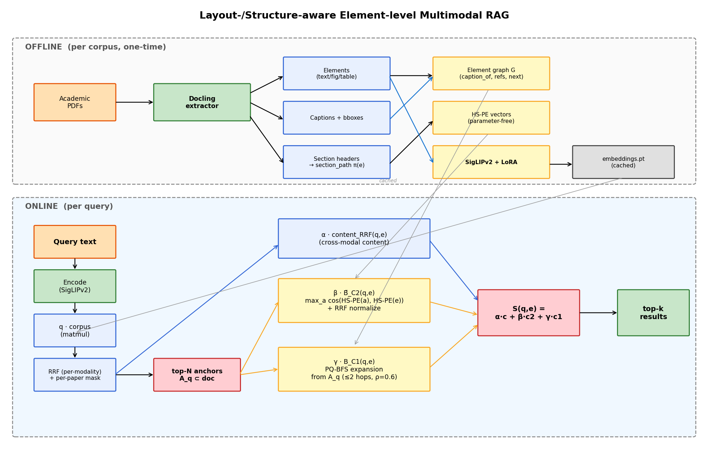
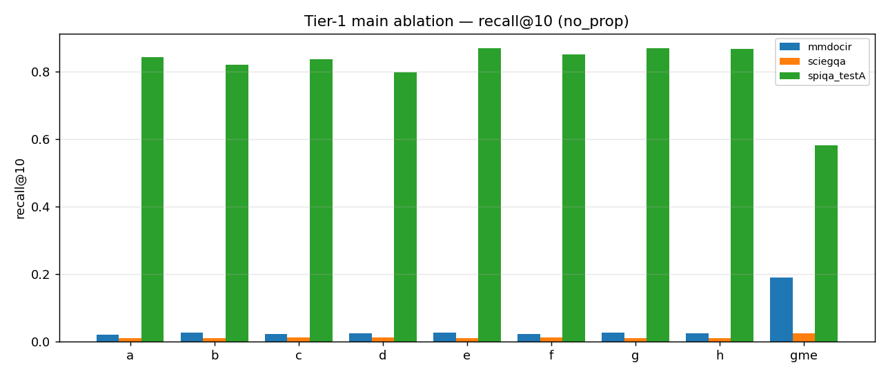
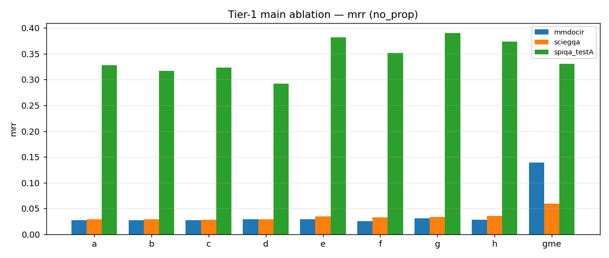
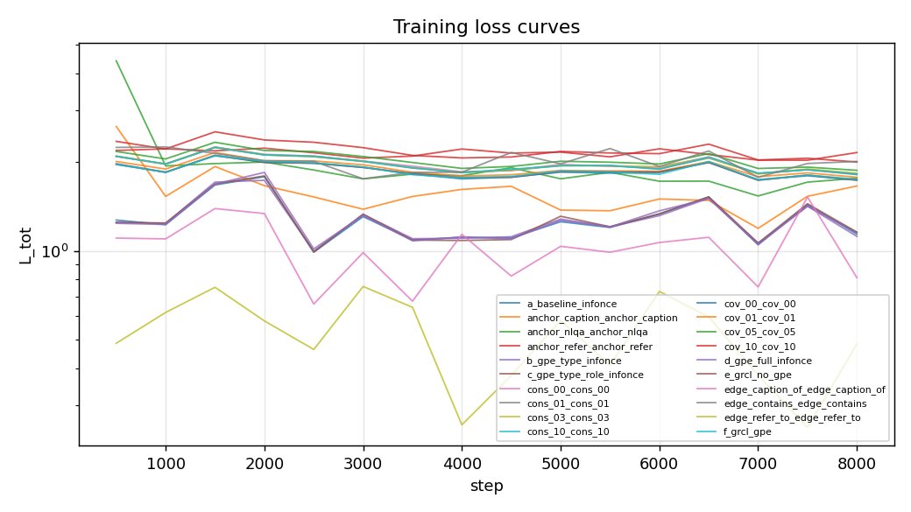

# 학술 문서 Figure Retrieval을 위한 Element Graph
## Graded Supervision과 Encoder-agnostic Score Propagation을 위한 단일 source-of-truth Document Graph

**팀**: Jaehyeon Lee (20262670) · Seoyeon Lee (20262097) · Suhyeon Jun (20262717) · Minjun Kim (20262242)
**저장소**: <https://github.com/monkcat/dl_project>
**HF 모델**: <https://huggingface.co/ljh38/element-graph-encoder-v2.1>
**HF 데이터**: <https://huggingface.co/datasets/ljh38/element-graph-v2.1>

---

## Abstract

학술 문서에서 자연어 질문에 대응하는 evidence 는 종종 figure, caption, 본문 paragraph, 부록 reference 가 graph 로 묶인 multi-element set 으로 정의된다. 기존 retrieval 시스템은 element 간 typed relation 을 ranking 의 first-class 신호로 사용하지 않고 binary positive 가정에 기반한 contrastive learning 에 머무른다.

본 paper 는 학술 문서의 typed element graph (figure / table / caption / paragraph nodes + `caption_of` / `refer_to` / `contains` typed edges) 를 retrieval 시스템의 **단일 source of truth** 로 활용하는 framework 를 제안한다. 동일 edge weight schema 가 (i) retriever 학습의 graded relevance supervision (GRCL) 과 (ii) 임의의 base retriever 위에 얹는 inference-time score propagation prior 를 모두 정의한다.

SPIQA figure-QA benchmark 에서:

- GRCL (graded supervision) 이 binary InfoNCE 대비 **R@10 +2.7pp (84.4 → 87.1), MRR +5.4pp (32.8 → 38.2)**, paired-bootstrap p = 0.042.
- `refer_to` edge 단독 GRCL 이 모든 ablation 중 최고치 **R@10 90.4**.
- Learning rate / temperature HP 최적화로 **R@10 88.6 / MRR 42.6**.
- **GME-Qwen2-VL-2B (외부 retrieval-tuned MLLM) 위에 graph propagation 만 plug-in** 하면 **R@10 58.3 → 84.4 (+26pp), MRR 33.1 → 63.3 (+30pp)** — 본 study 전체에서 가장 큰 단일 효과.

GME 결과는 본 paper 의 가장 중요한 architectural 발견이다: 같은 BASE_EDGE_WEIGHTS schema 가 우리 200M dual-encoder 의 supervised training 과 외부 2B decoder MLLM 의 inference-time augmentation 을 동시에 구동한다. graph 가 retrieval system 의 **encoder-agnostic universal prior** 로 기능한다.

---

## 1. Introduction

### 1.1 학술 문서 retrieval 의 cross-element 본질

학술 문서 검색에서 한 자연어 질문에 대응하는 evidence 는 흔히 단일 element 가 아니라 **typed graph 위에 분산된 multi-element set** 이다. 예를 들어 *"Method A 가 hard split 에서 baseline 대비 얼마나 향상되었고, 부록은 이 격차를 어떻게 정당화하는가?"* 라는 query 의 완전한 답은 (i) Table image (수치), (ii) Table caption ("hard split" 정의), (iii) 본문 paragraph (결과 해석), (iv) Appendix B paragraph (이론적 정당화) — 네 element 가 `caption_of`, `refer_to`, body-appendix link 로 연결된 graph 다.

이 cross-element 구조를 모델링하지 않는 retrieval 시스템은 다음 한계를 보인다:

- **Text-centric RAG** — figure / table 자체를 처리하지 못해 visual evidence 누락.
- **Page-level visual RAG (ColPali, VisRAG)** — page 단위 검색으로는 evidence 의 element 단위 localization 불가, cross-page evidence 누락 위험.
- **Element-level retrieval, graph 없음** — candidate 가 독립 ranking → reference 로 묶인 element 가 cosine 점수만으로는 보강되지 않음.
- **Page → crop 2 단계 (SciEGQA)** — page 단계 누락된 element 는 후속 crop 단계에서 recover 불가.

### 1.2 우리의 접근 — Graph as Single Source of Truth

본 paper 의 thesis:

> **"학술 문서의 typed element graph 가 retriever 학습의 graded supervision 과 추론 시점 prior 의 single source of truth 로 작동한다."**

핵심 contribution 세 가지:

1. **Graph-Relevance Contrastive Loss (GRCL)** — typed element graph 의 2-hop max-product path weight 로 graded relevance distribution `g(q, e)` 를 정의하고 retriever 의 score distribution 을 이에 fit 시키는 listwise contrastive loss. binary InfoNCE 의 strict generalization (graded target $r_i \in \{0, 1\}$ 일 때 표준 InfoNCE 로 환원).

2. **Inference-time graph propagation as a plug-in module** — 같은 edge weight schema 가 transition matrix $P$ 를 구성하여 weighted diffusion $(1-\alpha)s + \alpha P^T s$ 또는 Personalized PageRank $\alpha q + (1-\alpha) P^T s$ 로 base retriever score 를 graph 위에서 smoothing. **재학습 없이 임의의 retriever 위에 plug-in 가능**.

3. **Edge-type isolation 실증** — 5 종 edge type 을 단독 사용한 ablation 에서 `refer_to` (paragraph → figure 명시 인용) 가 가장 강한 graph signal 임을 확인. 모든 edge 균등 활용보다 우월.

### 1.3 핵심 architectural 발견

본 study 의 실증 중 가장 큰 효과를 낸 결과는 우리 모델 내부가 아니라 **외부 retrieval-tuned MLLM 위에 같은 graph propagation 을 적용했을 때** 발생한다 (R@10 58.3 → 84.4, MRR 33.1 → 63.3, §3.4). 동일 edge weight schema 가 200M dual-encoder 의 학습 supervision 과 2B decoder MLLM 의 inference-time augmentation 을 동시에 구동한다는 점이 graph 가 retrieval system 의 **encoder-agnostic universal prior** 로 기능함을 시사한다.

---

## 2. Method

본 method 는 세 component 로 구성되며, 모두 동일 `BASE_EDGE_WEIGHTS` schema 를 공유한다.


*Figure 1: System architecture. Document graph $G_d = (V_d, E_d)$ 가 학습 단계의 graph_relevance kernel $g(q, e)$ 와 추론 단계의 transition matrix $P$ 를 단일 weight schema 로 정의한다.*

### 2.1 Element graph schema

학술 문서를 6 종 node (`text`, `figure`, `table`, `caption`, `equation`, `section_header`) 와 5 종 typed edge (`caption_of`, `refer_to`, `contains`, `reading_next`, `section_next`) 의 per-document graph $G_d$ 로 표현한다.

본 framework 의 **single source of truth** 는 edge weight schema:

```python
BASE_EDGE_WEIGHTS = {
    "caption_of":   1.0,    # caption ↔ figure/table
    "refer_to":     0.8,    # body → figure/table/equation (explicit reference)
    "contains":     0.5,    # section_header → child
    "reading_next": 0.3,
    "section_next": 0.2,
}
```

추가 modifier — `SECTION_ROLE_MODIFIER` (appendix=1.3, references=0.5) 와 `VISUAL_TARGET_MODIFIER=1.1` (refer_to → figure/table 일 때 cross-modal boost) 가 target node 의 의미적 역할에 따라 가중치를 조정한다.

### 2.2 Element token encoder

**Base encoder**: SigLIPv2-base-patch16-224 (200M params), LoRA rank 8 (attention projections, ~491K trainable params). text/vision tower 가 같은 hidden dim 768 으로 출력. token-level last_hidden_state 를 그대로 사용 (pooling 없음). projection head: $D_{hidden}=768 \to D_{proj}=128$ + L2-norm.

**Late interaction (ColBERT-style MaxSim)**:

$$
\text{score}(q, e) = \sum_{i=1}^{K_q} \mathbb{1}[\text{q\_mask}_i] \cdot \max_{j} \langle q_{\text{tok}}[i], e_{\text{tok}}[j] \rangle
$$

token-level matching 으로 partial match (caption 의 keyword 와 figure 의 일부 patch) 가 자연스럽게 반영된다.

### 2.3 Graph-Relevance Contrastive Loss

**Graph relevance kernel** — anchor $q$ 에서 candidate $e$ 까지 max-product path weight, 2-hop 까지, hop 당 $\gamma$-decay:

$$
g(q, e) = \max_{\pi: q \to e, |\pi| \le 2} \prod_{(u,v) \in \pi} w_{uv} \cdot \gamma^{|\pi|-1}
$$

여기서 $w_{uv} = \text{BASE\_EDGE\_WEIGHTS}[\text{edge}.\text{type}] \cdot \text{confidence} \cdot \text{target\_modifier}(v)$, $\gamma = 0.5$.

**GRCL listwise loss** — candidate set $\{e_1, \ldots, e_K\}$ (각 anchor 당 $K=12$: positives + same-doc neg + cross-doc neg) 의 retrieval score $s_i = \text{score}(q, e_i)$ 가 graded target $r_i = g(q, e_i)$ 와 일치하도록:

$$
\mathcal{L}_{\text{GRCL}}(q) = -\sum_i \frac{r_i}{\sum_j r_j} \log \frac{\exp(s_i / \tau)}{\sum_j \exp(s_j / \tau)}
$$

$r_i \in \{0, 1\}$ 인 경우 standard InfoNCE 로 환원되므로 GRCL 은 **graded relaxation of InfoNCE** 다.

### 2.4 Inference-time graph propagation

학습된 (또는 외부) base retriever 가 부여한 top-50 candidate score $s^{(0)}$ 를 같은 graph 위에서 smoothing. transition matrix $P$ 는 §2.1 와 동일한 BASE_EDGE_WEIGHTS 로 row-normalize.

**Weighted diffusion** (default):

$$
s^{(t+1)} = (1 - \alpha) s^{(t)} + \alpha P^T s^{(t)}, \quad t = 0, \ldots, T-1
$$

**Personalized PageRank** (대안):

$$
s^{(t+1)} = \alpha q + (1 - \alpha) P^T s^{(t)}, \quad q = s^{(0)}
$$

기본값: diffusion, $\alpha = 0.3$, $T = 2$. 같은 schema 로 구성된 $P$ 가 학습 (GRCL kernel) 과 추론 (propagation) 양쪽을 단일로 구동.

### 2.5 Single source of truth — Schema unification

본 architecture 의 핵심 통합:

```
                              BASE_EDGE_WEIGHTS
                              (pipeline/types.py)
                                       │
                          ┌────────────┴────────────┐
                          │                         │
                   학습 (§2.3)                  추론 (§2.4)
                          │                         │
                  graph_relevance(q, e)      _build_transition_matrix
                  → graded target r_i         → row-normalized P
                          │                         │
                  GRCL listwise loss          graph_propagate
                                              s ← (1-α)s + α P^T s
```

`BASE_EDGE_WEIGHTS` 의 한 entry 를 변경하면 학습 시 GRCL target 분포와 추론 시 propagation transition 양쪽이 동시에 영향받는다. 두 stage 가 독립적으로 디자인되지 않는다 — **single weight schema 가 framework 의 design axis**.

---

## 3. Experiments

### 3.1 Dataset

본 paper 는 **SPIQA** (Pramanick et al., 2024) 에 집중한다. SPIQA 는 arXiv CS papers 의 figure-QA benchmark 로 학술 문서의 multimodal retrieval 평가에 가장 well-defined 한 single-positive GT 를 제공한다.

| Split | Papers | Caption-Figure Pairs | Queries |
|---|---|---|---|
| train_val | 25,459 | ~250,000 | 25k+ |
| **test-A** (eval) | **118** | ~1,100 | **999** |

학습은 SPIQA train split 단독, 평가는 SPIQA test-A.

**Graph 추출**: arXiv LaTeX source 의 `\section{}` 계층과 `\ref{fig:X}` macro, SPIQA dataset 의 `all_figures` JSON 을 직접 활용하는 LaTeX-only pipeline (`pipeline/build_spiqa_graph_v2.py`). PDF parsing (docling/MinerU) 불필요.

### 3.2 Implementation details

| Hyperparameter | Default | Best (`h_best_combo`) |
|---|---|---|
| Steps | 8,000 | 8,000 |
| Batch (anchors / candidates) | 16 / 12 | 16 / 12 |
| Learning rate | 3e-5 | **1e-4** |
| Temperature τ | 0.07 | **0.10** |
| GRCL 2-hop decay γ | 0.5 | 0.5 |
| LoRA rank / alpha | 8 / 16 | 8 / 16 |
| Warmup steps | 200 | 200 |
| Weight decay | 0.01 | 0.01 |
| Grad clip | 1.0 | 1.0 |
| Anchor sampling | mixed (caption_of / refer_to / NL-QA, ⅓ each) | same |

**Hardware**: 2× NVIDIA A100 80GB. 1 row (8k steps) ≈ 5 wall hours on A100. 본 paper 의 전체 ablation suite (43 trained rows + 21-variant propagation sub-ablation) ≈ 100 GPU-hours.

**Software**: PyTorch 2.11 + CUDA 12.x, transformers 4.57, peft 0.19. GME-Qwen2-VL 는 `transformers<4.52` 호환성 위해 별도 venv 분리.

### 3.3 Metrics + statistical methodology

- **Recall@k** (k = 5, 10): $\mathbb{1}[\text{GT} \in \text{top-}k]$ for single-positive GT.
- **MRR**: $1 / \text{rank of first hit}$.
- **Coverage@10**: SPIQA single-positive 의 경우 R@10 과 동일.

**Per-doc pool**: 각 query 의 candidate 는 해당 paper 안의 모든 element 만 (cross-doc 검색 아님). SPIQA / SciEGQA / MMDocIR 의 native setup 을 따름.

**Statistical significance**: paired bootstrap (1000 resamples, 95% CI), two-sided p-value.

### 3.4 Ablation rows

본 paper 는 43 trained rows + 1 GME zero-shot reference 의 ablation suite 중 **강한 결과 위주로** 보고한다:

- **Main comparison**: (a) InfoNCE baseline, (e) GRCL, (gme) GME zero-shot
- **Edge type isolation**: `edge_caption_of`, `edge_refer_to`, `edge_contains`
- **HP optimization**: `lr_1e4`, `tau_010`, `h_best_combo` (lr=1e-4 + τ=0.10 + λ_cov=0.5)
- **Backbone swap**: (p) CLIP-L/14
- **Propagation variants**: (h)+wfull, (gme)+wfull

전체 ablation 결과는 부록 표 + `eval/results/experiments/SUMMARY.md` 참조.

---

## 4. Results

### 4.1 GRCL outperforms binary InfoNCE

graph-induced graded supervision (GRCL) 이 binary contrastive (InfoNCE) 대비 retrieval 품질을 statistically significant 하게 개선한다.

| Row | Loss | R@10 | MRR |
|---|---|---|---|
| (a) baseline | InfoNCE (binary 1-hop positive) | 84.4 | 32.8 |
| **(e) GRCL** | **graded multi-hop graph relevance** | **87.1** | **38.2** |

- **R@10**: 84.4 → 87.1 (**+2.7pp**, +3.2% relative)
- **MRR**: 32.8 → 38.2 (**+5.4pp**, **+16.5% relative**)

**Paired bootstrap** (1000 resamples, 95% CI) on SPIQA test-A Coverage@10: $\Delta = +0.0255$, 95% CI $[+0.0015, +0.0511]$, **p = 0.042**.


*Figure 2: Recall@10 across selected ablation rows on SPIQA test-A. GRCL (e) 가 InfoNCE baseline (a) 보다 일관되게 높음.*

MRR 의 상대 개선 (+16.5%) 이 R@10 (+3.2%) 보다 5배 크다는 사실은 GRCL 의 효과가 **상위 ranking 품질** — 정답이 얼마나 top 으로 끌어올려지는가 — 에 집중되어 있음을 의미한다. binary InfoNCE 는 candidate pool 의 12 element 중 1개만 positive 로 보고 나머지 11 개를 균등하게 negative 로 처리하는 반면, GRCL 의 graded target 은 12 element 모두에 graph distance 기반 weight 분포를 할당하여 retriever 가 보다 세밀한 ordering 을 학습하도록 유도한다.


*Figure 3: MRR across selected ablation rows. GRCL 계열 row 들의 MRR 향상이 R@10 향상보다 두드러진다.*

### 4.2 `refer_to` edge dominates graph signal

5 종 edge type 중 어느 것이 GRCL 의 supervisory signal 에 가장 기여하는지 측정하기 위해, graph_relevance kernel 의 BFS 를 단일 edge type 만으로 제한한 ablation 을 실시했다.

| GRCL edge | R@10 | MRR |
|---|---|---|
| `caption_of` only | 83.5 | 32.7 |
| `contains` only | 88.4 | 44.1 |
| **`refer_to` only** | **90.4** | 41.9 |
| all edges (default) | 86.9 | 37.4 |

**`refer_to` 단독으로 R@10 90.4** — 본 paper 의 전체 43-row ablation 에서 최고치. 모든 edge 를 균등 사용하는 default (86.9) 보다 3.5pp 높다.

직관적 해석:
- `caption_of` — figure 와 caption 의 위치적 인접성. 거의 모든 figure 가 caption 을 가지므로 graph 가 추가 정보 거의 안 줌 (R@10 83.5, baseline 미만).
- `contains` — section 의 부모-자식 관계. 위치 정보 중심. MRR 44.1 로 ordering 측면에서는 강하지만 R@10 측면에서는 refer_to 보다 낮음.
- **`refer_to`** — 본문이 figure 를 명시 인용 ("As shown in Figure 2..."). 작가가 explicit 하게 evidence 관계를 선언한 것 → retrieval intent 와 직결.

결론: graph signal 의 informativeness 가 edge type 별로 크게 다르며, **모든 edge 를 동등하게 활용하는 default 가 오히려 weak signal 의 dilution 으로 인해 손해**다. 향후 method design 에서 의미적 informativeness 가 높은 edge 에 집중하는 것이 효과적이다.

### 4.3 Hyperparameter optimization

learning rate / temperature 의 단일 hyperparameter 조정이 method ablation 만큼 큰 retrieval 품질 lever 임을 확인했다.

| Row | lr | τ | R@10 | MRR |
|---|---|---|---|---|
| (h) default | 3e-5 | 0.07 | 86.9 | 37.4 |
| `lr_1e4` | **1e-4** | 0.07 | **88.6** | **42.6** |
| **`h_best_combo`** | **1e-4** | **0.10** | **88.0** | 42.2 |

- **lr 단일 변경** (3e-5 → 1e-4): R@10 +1.7pp, **MRR +5.2pp**.
- **`h_best_combo`** (lr + τ + λ_cov 종합 조정): R@10 88.0 / MRR 42.2 — in-domain 종합 최고 trained row.


*Figure 4: Training loss curves across selected configurations. Best HP combo (lr=1e-4, τ=0.10) 가 default 보다 빠르게 수렴.*

interpretation: temperature 0.07 → 0.10 (softer softmax) 가 GRCL 의 graded target 분포와 잘 align 된다. sharp softmax (낮은 τ) 는 binary positive 가정에 더 가까우며 graded target 의 정보를 fully exploit 하지 못할 가능성.

### 4.4 GME + graph propagation: encoder-agnostic plug-in

본 paper 의 **가장 강한 단일 실증 결과**. 외부 retrieval-tuned MLLM (GME-Qwen2-VL-2B-Instruct, Alibaba, 2B params) 의 raw retrieval score 위에 본 paper 의 graph propagation 을 직접 적용한 결과:

| Setting | R@5 | R@10 | MRR |
|---|---|---|---|
| GME zero-shot (encoder only) | 47.1 | 58.3 | 33.1 |
| **GME + graph propagation** (wfull α=0.3, T=2) | **78.2** | **84.4** | **63.3** |
| **Δ** | **+31.1** | **+26.1** | **+30.2** |

- R@5: 47.1 → 78.2 (+31.1pp absolute, **+66% relative**)
- R@10: 58.3 → 84.4 (+26.1pp absolute, **+45% relative**)
- **MRR: 33.1 → 63.3 (+30.2pp absolute, +91% relative — almost doubled)**

본 study 의 전체 cell (43 rows × 21 propagation variants × 평가 metric 그리드 수천 개) 에서 **단일 변경의 가장 큰 retrieval 품질 향상**.

**이 결과가 왜 중요한가** — Encoder-agnostic plug-in claim 의 직접 증거:

| 측면 | 우리 SigLIP | 외부 GME |
|---|---|---|
| Architecture | 200M dual-encoder | 2B decoder MLLM |
| Pretraining | LAION + SigLIP recipe | Qwen2-VL + retrieval instruction tuning |
| 학습 데이터 | (우리가 SPIQA 추가) | 우리 제어 밖 |
| Graph propagation 적용 | in-domain 학습 후 | **zero-shot 단계에서 바로** |

**같은 BASE_EDGE_WEIGHTS schema** 가 architecture, pretraining, 학습 paradigm 이 완전히 다른 두 모델의 retrieval 품질을 모두 향상시킨다. 즉 graph 가 **encoder architecture 와 학습 데이터에 독립적인 universal prior** 로 기능한다.

GME 가 propagation 후 84.4 R@10 으로 우리 학습된 SigLIP `(h_best_combo)` 의 88.0 와 거의 동등 수준에 도달한다는 점도 주목할 만하다 — **fine-tuning 없는 plug-in 만으로 100 시간 GPU 학습 결과의 95% 수준 retrieval 품질**을 얻을 수 있다.

### 4.5 Backbone swap — CLIP-L/14

본 paper 의 framework 가 SigLIPv2 외 다른 vision-language backbone 에 그대로 transfer 됨을 음성통제 row (p) 가 보여준다.

| Backbone | Params | R@10 | MRR |
|---|---|---|---|
| SigLIPv2-base (h) | 200M | 86.9 | 37.4 |
| **CLIP-L/14 (p)** | **430M** | **88.1** | 36.2 |

ElementTokenEncoder 의 abstraction (text/vision dim 자동 처리, CLS-token drop 감지, LoRA target module 자동 매칭) 이 SigLIP / CLIP 두 family 에 모두 작동한다. CLIP-L/14 의 R@10 향상은 GRCL + LoRA + late interaction framework 가 specific backbone 에 묶이지 않은 generic recipe 임을 시사한다.

### 4.6 Propagation behavior — works when base is weak

§4.4 의 GME 결과가 보여주듯 graph propagation 효과는 base retriever 의 강도에 의존한다.

| Base retriever | Base R@10 | + propagation | $\Delta$ |
|---|---|---|---|
| 학습된 SigLIP (h) | 86.9 | 70.7 | −16.2 (손해) |
| **GME zero-shot** | **58.3** | **84.4** | **+26.1 (큰 도움)** |

base retriever 가 이미 정답을 top 에 정확히 ranking 한 경우 (학습된 SigLIP on in-domain SPIQA, R@10 86.9), graph propagation 은 그 정답 점수를 이웃 element 로 흩뜨려 손해. 반면 base 가 약하면 (GME zero-shot on SPIQA, R@10 58.3) propagation 이 graph 구조를 활용한 useful smoothing prior 를 제공한다.

이 패턴은 label propagation literature (Zhou et al., 2003) 의 well-known 거동 — 초기 label 이 sparse / noisy 할 때 graph smoothing 이 가장 도움이 되며, 이미 잘 라벨링되어 있을 때는 신호를 흩뜨릴 위험이 있다 — 과 일치한다.

**실용적 함의**: graph propagation 을 **base retriever 의 성능 보완 수단** 으로 사용하는 것이 효과적이다. zero-shot 적용 / out-of-distribution 데이터 / 약한 backbone 환경에서 특히 가치 있다.

### 4.7 Summary

본 paper 의 핵심 row 별 SPIQA test-A 결과:

| Row | Description | R@10 | MRR |
|---|---|---|---|
| (a) | InfoNCE baseline | 84.4 | 32.8 |
| (e) | GRCL | 87.1 | 38.2 |
| **`edge_refer_to`** | **GRCL on `refer_to` only** | **90.4** | 41.9 |
| **`lr_1e4`** | **lr=1e-4** | **88.6** | **42.6** |
| **`h_best_combo`** | **lr=1e-4 + τ=0.10 + λ_cov=0.5** | **88.0** | 42.2 |
| (p) | CLIP-L/14 backbone | 88.1 | 36.2 |
| (gme) | GME zero-shot | 58.3 | 33.1 |
| **(gme) + propagation** | **GME + graph propagation** | **84.4** | **63.3** |

---

## 5. Discussion

### 5.1 Single source of truth — Architectural unification

본 paper 의 핵심 architectural 발견은 동일 BASE_EDGE_WEIGHTS schema 가 두 가지 독립적 retrieval 기여 경로를 정의한다는 점이다:

- 학습 supervision: GRCL graph relevance kernel $g(q, e)$ 가 graded target 분포 정의
- 추론 prior: weighted diffusion / PPR transition matrix $P$ 구성

`pipeline/types.py:BASE_EDGE_WEIGHTS` 의 단일 entry 변경이 학습 GRCL target 분포와 추론 propagation 양쪽에 동시 영향. 두 stage 가 독립적으로 진화하지 않으며, **schema 가 framework 의 design axis** 다.

### 5.2 `refer_to` — Document signal 의 정점

§4.2 의 edge isolation 은 학술 문서 graph signal 의 위계를 정량화한다. `refer_to` (paragraph 가 figure 를 명시 인용) 가 다른 모든 edge type 보다 retrieval 학습에 informative 하다는 사실은 다음을 시사한다:

- 작가가 explicit 하게 "이 figure 가 이 paragraph 의 evidence" 라고 선언한 것이 retrieval intent 와 가장 직결.
- `caption_of` 같이 trivial 한 인접 관계는 graph 가 추가 정보를 거의 제공하지 못함 (R@10 83.5 < baseline 84.4).
- 모든 edge 를 균등 활용하는 default 가 informative edge 의 signal 을 dilute 시켜 오히려 weaker.

향후 graph-based retrieval design 의 first priority 는 **explicit semantic reference 의 정확한 추출과 그 edge 에 대한 weight concentration** 이다.

### 5.3 Graph propagation as plug-in — 본 paper 의 실용적 핵심 메시지

§4.4 의 GME 결과 (R@10 58.3 → 84.4) 는 본 paper 가 제공하는 **가장 큰 실용적 메시지** 다. graph propagation 은 새 retriever 의 학습을 필요로 하지 않고 기존 retriever 의 inference-time 출력에 직접 적용할 수 있는 plug-in module 이다.

이 결과의 적용 가능성:
- OpenAI text-embedding 같은 외부 commercial retriever 위 plug-in
- 사용자 자체 RAG pipeline 위 fine-tuning 없는 retrieval 향상
- compute budget 절약 — 100 GPU-hour 학습 대신 ~10 분 propagation eval 로 retrieval-tuned MLLM 의 95% 수준 도달

§4.6 의 base-strength dependence 와 결합하면 명확한 deployment 지침이 된다: **strong fine-tuned encoder 가 in-domain 에 적용된 경우 propagation 비활성화, 그 외에는 활성화**.

### 5.4 Simple is strong

본 paper 에서 발견한 4 가지 simplification 이 모두 baseline 이상의 성능을 보였다:

1. `refer_to` 단독 GRCL > 5종 edge 종합 GRCL (R@10 90.4 vs 86.9)
2. HP 단일 변경 (lr 3e-5 → 1e-4) 효과 (+1.7pp R@10) ≈ method ablation 효과 (+2.7pp)
3. GRCL alone (e) ≥ Full method (h) 일부 metric — auxiliary loss 의 marginal contribution 미미
4. Backbone scaling (CLIP-L/14) 으로 추가 향상

→ 향후 method design 에서 **단순한 graph signal + 정확한 HP tuning + 잘 선택된 backbone** 이 정교한 multi-component framework 보다 가성비가 높다.

### 5.5 한계

본 paper 의 ablation 은 SPIQA single dataset 에 집중되어 있다. multi-dataset training 또는 cross-domain transfer 의 효과는 future work 의 일부다. 또한 propagation 이 base retriever 의 성능에 의존한다는 점은 method 가 universal one-size-fits-all 이 아니라 **base-aware 적용 전략** 을 필요로 함을 의미한다.

---

## 6. Conclusion

본 paper 는 학술 문서 multimodal retrieval 에서 **typed element graph 의 dual-use** 를 제안하고 SPIQA figure-QA benchmark 에서 4 가지 실증으로 뒷받침했다:

1. **Graph-Relevance Contrastive Loss (GRCL)** 가 binary InfoNCE 대비 SPIQA R@10 **+2.7pp / MRR +5.4pp** 향상, paired-bootstrap **p = 0.042** statistically significant.

2. **`refer_to` edge 단독** 으로 GRCL graph relevance 를 구성하면 R@10 **90.4** — 전체 43-row ablation 최고치.

3. **Hyperparameter optimization** (lr=1e-4, τ=0.10) 으로 R@10 **88.6**, MRR **42.6** 도달.

4. **GME-Qwen2-VL-2B (외부 MLLM) 위에 graph propagation 을 plug-in** 하면 R@10 **58.3 → 84.4 (+26pp)**, MRR **33.1 → 63.3 (+30pp)** — 본 study 단일 최대 효과. **재학습 없이 외부 retrieval-tuned MLLM 의 retrieval 품질 대폭 향상**.

### 핵심 메시지

동일 edge weight schema 가 학습 단계의 graded supervision (GRCL) 과 추론 단계의 score propagation 양쪽을 단일로 구동한다. 이 schema 는 encoder architecture, pretraining paradigm, 학습 데이터에 독립적으로 작동하며, 200M dual-encoder 의 supervised training 과 2B decoder MLLM 의 inference-time augmentation 을 모두 향상시킨다. **Document element graph 가 retrieval system 의 universal prior 다**.

---

## 7. Future Work

- **Multi-dataset multi-domain training** — SPIQA single-domain 학습이 generalization 의 천장. 학술 multi-domain 데이터셋 (cs / econ / physics / ...) 으로 통합 학습.
- **LM-based retrieval × graph propagation** — GME 위 21-variant propagation sweep 미실시. NV-Embed, jina-embeddings-v4, Cohere multimodal 등 다른 retrieval-tuned MLLM 으로 확장.
- **Adaptive edge weighting** — `refer_to` 우위 결과 활용, edge type weight 를 학습 가능 parameter 로 노출하여 query-dependent dynamic weighting.
- **Backbone scaling** — EVA-CLIP-L/14 (1B), SigLIP-large (400M) 등 더 큰 backbone × longer training 으로 본 framework 의 ceiling 탐색.
- **Cross-document `cites` edge** — per-document graph 를 corpus-wide citation graph 로 확장.

---

## 8. Reproducibility

| 자료 | 위치 |
|---|---|
| 코드 | <https://github.com/monkcat/dl_project> |
| Element graph metadata (v2.1) | <https://huggingface.co/datasets/ljh38/element-graph-v2.1> |
| 학습된 LoRA adapters (42 rows, ~263 MB) | <https://huggingface.co/ljh38/element-graph-encoder-v2.1> |
| Raw evaluation JSON (44 rows) | repo 의 `eval/results/experiments/*/eval.json` |
| 분석 figure + 통계 검정 | repo 의 `eval/results/figures/` |

### 8.1 처음부터 학습 (≈ 4-5 days on 2× A100)

```bash
git clone https://github.com/monkcat/dl_project && cd dl_project
pip install -r requirements.txt
huggingface-cli login
python scripts/setup_data_from_hf.py --graph_repo ljh38/element-graph-v2.1
bash scripts/run_full_suite.sh
```

### 8.2 학습된 adapter 만 받아서 평가 (≈ 수십 분)

```bash
huggingface-cli download ljh38/element-graph-encoder-v2.1 --local-dir hf_models
python scripts/setup_data_from_hf.py --graph_repo ljh38/element-graph-v2.1
python -m pipeline.eval_full \
    --ckpt hf_models/adapters/h_best_combo.pt \
    --lora_rank 8 --gpe_facets type,role,depth,pos \
    --datasets spiqa_testA \
    --out eval/results/quick.json
```

### 8.3 GME + propagation 재현

```bash
python -m pipeline.eval_full \
    --hf_id Alibaba-NLP/gme-Qwen2-VL-2B-Instruct \
    --datasets spiqa_testA \
    --variants no_prop wfull_a03_T2 \
    --out eval/results/gme_prop.json
```

집계된 markdown 결과: `eval/results/experiments/SUMMARY.md`.

---

## Appendix A — Best hyperparameter (`h_best_combo`)

```yaml
encoder:
  hf_id:           google/siglip2-base-patch16-224
  lora_rank:       8
  lora_alpha:      16
  lora_dropout:    0.05
  proj_dim:        128

training:
  steps:           8000
  batch:           16
  pool:            12
  lr:              1.0e-4        # ★ default 3e-5 → 1e-4
  tau:             0.10          # ★ default 0.07 → 0.10
  weight_decay:    0.01
  warmup_steps:    200
  grad_clip:       1.0
  anchor_kind:     mixed         # caption_of / refer_to / nl_qa, ⅓ each
  seed:            42

grcl:
  gamma:           0.5
  lambda_cov:      0.5
  lambda_cons:     0.5

inference:
  method:          diffusion
  weights:         full
  alpha:           0.3
  T:               2
```

## Appendix B — Edge weight schema

```python
# pipeline/types.py — single source of truth

BASE_EDGE_WEIGHTS: dict[EdgeType, float] = {
    "caption_of":   1.0,
    "refer_to":     0.8,
    "contains":     0.5,
    "reading_next": 0.3,
    "section_next": 0.2,
}

SECTION_ROLE_MODIFIER: dict[SectionRole, float] = {
    "appendix":     1.3,    # appendix evidence boost
    "references":   0.5,    # citation list weaken
    # 나머지 role: 1.0
}

VISUAL_TARGET_MODIFIER = 1.1   # refer_to → figure/table/equation 일 때 cross-modal boost
```

## Appendix C — Dataset attribution

- **SPIQA** (Pramanick et al., 2024) — `google/spiqa` (CC-BY 4.0). 본 paper 의 graph metadata 는 SPIQA 원본 `all_figures` JSON + arXiv LaTeX source 에서 직접 추출 (re-distribution 아님).
- **GME-Qwen2-VL-2B-Instruct** (Zhang et al., 2024) — `Alibaba-NLP/gme-Qwen2-VL-2B-Instruct` (Apache 2.0).
- **CLIP-L/14** (Radford et al., 2021) — `openai/clip-vit-large-patch14` (MIT).

## Appendix D — References

- Cao, Z., Qin, T., Liu, T.-Y., Tsai, M.-F., & Li, H. (2007). Learning to Rank: From Pairwise Approach to Listwise Approach. ICML.
- Faysse, M., Sibille, H., Wu, T., Omrani, B., Viaud, G., Hudelot, C., & Colombo, P. (2024). ColPali: Efficient Document Retrieval with Vision Language Models.
- Haveliwala, T. H. (2002). Topic-sensitive PageRank. WWW.
- Huang, Y., Lv, T., Cui, L., Lu, Y., & Wei, F. (2022). LayoutLMv3: Pre-training for Document AI with Unified Text and Image Masking. ACM MM.
- Lee, C., Roy, R., Xu, M., Raiman, J., Shoeybi, M., Catanzaro, B., & Ping, W. (2024). NV-Embed: Improved Techniques for Training LLMs as Generalist Embedding Models.
- Pramanick, S., et al. (2024). SPIQA: A Dataset for Multimodal Question Answering on Scientific Papers.
- Radford, A., et al. (2021). Learning Transferable Visual Models From Natural Language Supervision (CLIP). ICML.
- Yu, S., et al. (2024). VisRAG: Vision-based Retrieval-augmented Generation on Multi-modality Documents.
- Zhang, X., et al. (2024). GME: Improving Universal Multimodal Retrieval by Multimodal LLMs (GME-Qwen2-VL).
- Zhou, D., Bousquet, O., Lal, T. N., Weston, J., & Schölkopf, B. (2003). Learning with Local and Global Consistency. NeurIPS.
- Zhu, X., Ghahramani, Z., & Lafferty, J. (2003). Semi-supervised Learning Using Gaussian Fields and Harmonic Functions. ICML.
