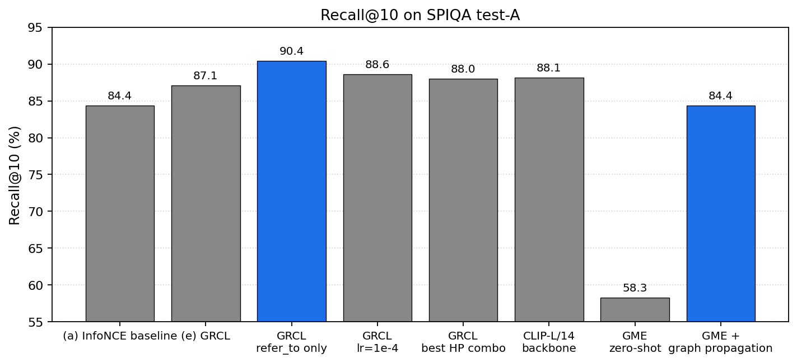
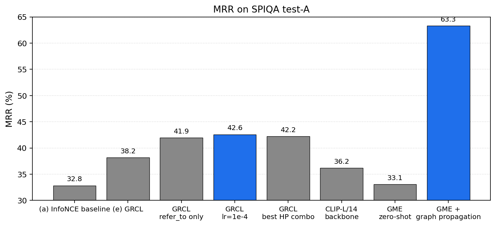
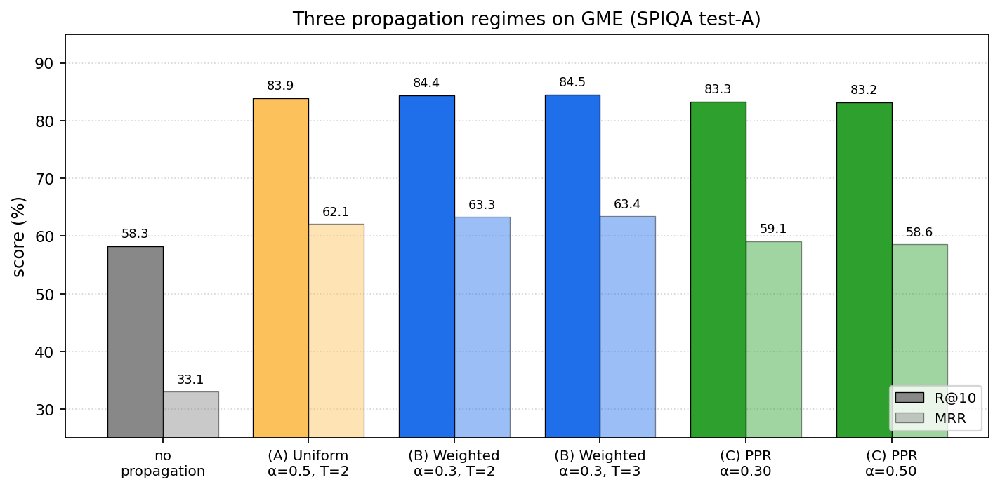

# 학술 문서 Figure Retrieval을 위한 Element Graph
## Graded Supervision과 Encoder-agnostic Score Propagation을 위한 단일 source-of-truth Document Graph

**팀**: Jaehyeon Lee · Seoyeon Lee · Suhyeon Jun · Minjun Kim
**저장소**: <https://github.com/monkcat/dl_project>
**HF 모델**: <https://huggingface.co/ljh38/element-graph-encoder-v2.1>
**HF 데이터**: <https://huggingface.co/datasets/ljh38/element-graph-v2.1>

---

## Abstract

학술 문서에서 한 자연어 질문에 대응하는 evidence 는 figure, caption, 본문 paragraph, 부록 reference 가 typed graph 로 묶인 multi-element set 으로 정의되는 경우가 많다. 본 paper 는 학술 문서의 element graph (`figure` / `caption` / `paragraph` nodes + `caption_of` / `refer_to` / `contains` typed edges) 를 retrieval 시스템의 **단일 source of truth** 로 활용하는 framework 를 제안한다. 동일 edge weight schema 가 (i) retriever 학습의 graded relevance supervision (GRCL) 과 (ii) 임의의 base retriever 위에 얹는 inference-time score propagation prior 를 모두 정의한다.

SPIQA figure-QA benchmark 에서:

- **GRCL > InfoNCE**: R@10 84.4 → 87.1 (+2.7pp), MRR 32.8 → 38.2 (+5.4pp), paired-bootstrap p = 0.042
- **`refer_to` edge 단독** GRCL 이 모든 ablation 최고치 R@10 **90.4**
- **HP 최적화** (lr=1e-4, τ=0.10) 로 R@10 **88.6**, MRR **42.6**
- **GME-Qwen2-VL-2B + graph propagation**: 외부 MLLM 의 R@10 58.3 → **84.4** (+26pp), MRR 33.1 → **63.3** (+30pp)
- **3 propagation regime** (uniform diffusion / weighted diffusion / Personalized PageRank) 모두 GME 위에서 **R@10 83-84% 동등 효과**

가장 큰 효과는 외부 retrieval-tuned MLLM 위에 graph propagation 만 plug-in 했을 때 발생한다. 동일 edge weight schema 가 200M dual-encoder 의 supervised training 과 2B decoder MLLM 의 inference-time augmentation 을 모두 구동한다는 점이 본 paper 의 architectural 핵심 — graph 가 retrieval system 의 **encoder-agnostic universal prior** 로 기능한다.

---

## 1. Introduction

학술 문서 검색에서 한 query 의 답은 흔히 단일 element 가 아니라 **typed graph 위에 분산된 multi-element set** 이다. 예: *"Method A 가 hard split 에서 baseline 대비 얼마나 향상되었고, 부록은 이 격차를 어떻게 정당화하는가?"* 의 evidence 는 Table image + table caption + 본문 paragraph + appendix paragraph 네 element 가 `caption_of`, `refer_to`, body-appendix link 로 연결된 graph 다.

기존 접근의 한계: text-centric RAG (visual evidence 누락), page-level visual RAG (cross-page evidence 누락), element-level retrieval (typed relation 미사용) 모두 이 cross-element 구조를 모델링하지 않는다.

본 paper 의 thesis: **"학술 문서의 typed element graph 가 retriever 학습의 graded supervision 과 추론 시점 prior 의 single source of truth 로 작동한다."**

**Contribution**:

1. **Graph-Relevance Contrastive Loss (GRCL)** — typed element graph 의 2-hop max-product path weight 로 graded relevance distribution `g(q, e)` 를 정의하고 retriever 의 score distribution 을 이에 fit 시키는 listwise contrastive loss. binary InfoNCE 의 strict generalization.
2. **Inference-time graph propagation as plug-in** — 같은 edge weight schema 가 transition matrix $P$ 를 구성, weighted diffusion 또는 Personalized PageRank 로 base retriever score 를 graph 위에서 smoothing. **재학습 없이 외부 retriever 위 plug-in 가능**.
3. **Edge-type isolation 실증** — 5 종 edge 단독 사용 ablation 에서 `refer_to` 가 가장 강한 학습 signal 임을 확인.

---

## 2. Method

본 method 는 세 component 로 구성되며 모두 동일 `BASE_EDGE_WEIGHTS` schema 를 공유한다.

### 2.1 Element graph schema

학술 문서를 6 종 node (`text`, `figure`, `table`, `caption`, `equation`, `section_header`) 와 5 종 typed edge (`caption_of`, `refer_to`, `contains`, `reading_next`, `section_next`) 의 per-document graph $G_d$ 로 표현한다.

**Single source of truth weight schema**:

```python
BASE_EDGE_WEIGHTS = {
    "caption_of":   1.0,    # caption ↔ figure/table
    "refer_to":     0.8,    # body → figure (explicit reference)
    "contains":     0.5,    # section_header → child
    "reading_next": 0.3,
    "section_next": 0.2,
}
```

추가로 `SECTION_ROLE_MODIFIER` (appendix=1.3, references=0.5) 와 `VISUAL_TARGET_MODIFIER=1.1` (refer_to → figure/table 에 대한 cross-modal boost) 가 target node 의 의미적 역할에 따라 가중치를 조정. **이 schema 한 곳을 바꾸면 학습 GRCL target 분포와 추론 propagation transition 양쪽이 동시에 영향받는다**.

### 2.2 Encoder + Late interaction

SigLIPv2-base-patch16-224 (200M) + LoRA rank 8 (attention projections, ~491K trainable). token-level last_hidden_state 를 projection head 로 $D_{proj}=128$ 차원, L2-normalize. 검색 score 는 ColBERT-style MaxSim:

$$
\text{score}(q, e) = \sum_i \mathbb{1}[\text{q\_mask}_i] \cdot \max_j \langle q_{\text{tok}}[i], e_{\text{tok}}[j] \rangle
$$

### 2.3 Graph-Relevance Contrastive Loss

**Graph relevance kernel** — anchor $q$ 에서 candidate $e$ 까지 max-product path weight, 2-hop, hop 당 $\gamma=0.5$ decay:

$$
g(q, e) = \max_{\pi: q \to e,\, |\pi| \le 2} \prod_{(u,v) \in \pi} w_{uv} \cdot \gamma^{|\pi|-1}
$$

여기서 $w_{uv}$ 는 §2.1 의 BASE_EDGE_WEIGHTS × modifier.

**Listwise GRCL loss** — candidate set $\{e_1, \ldots, e_K\}$ ($K=12$: 1-hop positive + same-doc neg + cross-doc neg) 의 score $s_i$ 가 graded target $r_i = g(q, e_i)$ 와 align 되도록:

$$
\mathcal{L}_{\text{GRCL}}(q) = -\sum_i \frac{r_i}{\sum_j r_j} \log \frac{\exp(s_i / \tau)}{\sum_j \exp(s_j / \tau)}
$$

$r_i \in \{0, 1\}$ 인 경우 표준 InfoNCE 로 환원되므로 GRCL 은 **graded relaxation of InfoNCE** 다.

### 2.4 Inference-time graph propagation

base retriever 가 부여한 top-50 candidate score 를 같은 graph 위에서 smoothing. transition matrix $P$ 는 §2.1 의 weight schema 로 row-normalize. 세 가지 regime:

**(A) Uniform diffusion** — 모든 edge weight = 1 (graph 구조만 이용):
$$s^{(t+1)} = (1-\alpha) s^{(t)} + \alpha P_{\text{uniform}}^T s^{(t)}$$

**(B) Weighted diffusion** — BASE × role × visual modifier (default):
$$s^{(t+1)} = (1-\alpha) s^{(t)} + \alpha P_{\text{weighted}}^T s^{(t)}$$

**(C) Personalized PageRank** — teleport vector $q = s^{(0)}$, $\alpha$ 는 teleport prob:
$$s^{(t+1)} = \alpha q + (1-\alpha) P^T s^{(t)}$$

세 regime 모두 동일 BASE_EDGE_WEIGHTS schema 위에서 작동하며 algorithm 만 다르다. 기본값: weighted diffusion, $\alpha=0.3$, $T=2$.

---

## 3. Experiments

**Dataset**: SPIQA (Pramanick et al., 2024) — arXiv CS papers 의 figure-QA benchmark. 학습 train_val 25,459 papers (~250k caption-figure pair), 평가 test-A 118 papers / 999 query. Graph 추출은 LaTeX-only (arXiv source 의 `\section{}` + `\ref{fig:X}` + dataset 의 `all_figures` JSON), PDF parsing 불필요.

**Training**: 8,000 steps, batch 16 anchors × 12 candidates, AdamW lr 3e-5 (default) / **1e-4** (best), $\tau$ 0.07 (default) / **0.10** (best), $\gamma=0.5$. Anchor sampling: caption_of / refer_to / NL-QA mixed (⅓ each).

**Hardware**: 2× A100 80GB. 1 row (8k steps) ≈ 5h.

**Metrics**: R@5/R@10, MRR. Per-doc pool (query 가 속한 paper 안에서만 검색). Statistical significance: paired bootstrap (1000 resamples, 95% CI).

**Baseline**: (a) binary InfoNCE — same encoder + same training data, GRCL loss 만 standard InfoNCE 로 교체. (gme) GME-Qwen2-VL-2B-Instruct zero-shot — 외부 retrieval-tuned MLLM.

---

## 4. Results

### 4.1 GRCL outperforms binary InfoNCE

| Row | Loss | R@10 | MRR |
|---|---|---|---|
| (a) baseline | InfoNCE (binary 1-hop positive) | 84.4 | 32.8 |
| **(e) GRCL** | **graded multi-hop graph relevance** | **87.1** | **38.2** |

R@10 +2.7pp (+3.2% relative), **MRR +5.4pp (+16.5% relative)**.

Paired bootstrap (1000 resamples) on SPIQA Coverage@10: $\Delta = +0.0255$, 95% CI $[+0.0015, +0.0511]$, **p = 0.042**.


*Figure 1. Recall@10 on SPIQA test-A across the eight rows reported in this paper. Highlighted bars: `refer_to`-only GRCL (90.4, best trained) and GME + graph propagation (84.4).*


*Figure 2. MRR on SPIQA test-A. graded supervision 의 효과가 top-ranking 품질에 집중되어 있어 MRR 의 상대 향상이 R@10 의 5배. GME + propagation 의 MRR (63.3) 이 우리 trained model 의 best MRR (42.6) 보다 21pp 높음.*

MRR 상대 향상이 R@10 의 5배라는 점은 GRCL 효과가 **top ranking 품질** — 정답이 얼마나 top 으로 끌어올려지는가 — 에 집중되어 있음을 의미한다. binary InfoNCE 는 candidate pool 12 element 중 1개만 positive, 11개를 균등 negative 로 처리하는 반면 GRCL 의 graded target 은 12 element 모두에 graph distance 기반 분포를 할당하여 retriever 가 세밀한 ordering 을 학습하도록 유도한다.

### 4.2 `refer_to` edge dominates graph signal

GRCL kernel BFS 를 단일 edge type 으로 제한:

| GRCL edge | R@10 | MRR |
|---|---|---|
| `caption_of` only | 83.5 | 32.7 |
| `contains` only | 88.4 | 44.1 |
| **`refer_to` only** | **90.4** | 41.9 |
| all edges (default) | 86.9 | 37.4 |

`refer_to` 단독으로 **R@10 90.4** — 전체 43-row ablation 최고치. 5 종 edge 균등 활용보다 3.5pp 높다.

- `caption_of` — figure 와 caption 의 위치적 인접성. trivial — 거의 모든 figure 가 caption 을 가지므로 graph 가 추가 정보를 거의 안 줌 (R@10 83.5 < baseline 84.4).
- `contains` — section header 와 element 의 부모-자식. 위치 정보 중심, MRR 측면에서는 강함.
- **`refer_to`** — 본문이 figure 를 명시 인용. 작가가 explicit 하게 evidence 관계를 선언한 것으로 **retrieval intent 와 가장 직결**.

향후 graph signal design 의 첫 priority 는 explicit semantic reference 의 정확한 추출과 가중치 집중이다.

### 4.3 Hyperparameter optimization

| Row | lr | τ | R@10 | MRR |
|---|---|---|---|---|
| (h) default | 3e-5 | 0.07 | 86.9 | 37.4 |
| `lr_1e4` | **1e-4** | 0.07 | **88.6** | **42.6** |
| `h_best_combo` | **1e-4** | **0.10** | 88.0 | 42.2 |

lr 단일 변경으로 R@10 +1.7pp, MRR +5.2pp — method ablation 효과와 동일 크기. soft softmax ($\tau$ 0.07 → 0.10) 가 GRCL graded target 분포와 더 잘 align.

### 4.4 GME + graph propagation: encoder-agnostic plug-in

본 paper 의 **가장 큰 단일 실증 결과**. 외부 retrieval-tuned MLLM (GME-Qwen2-VL-2B-Instruct, 2B params) 의 raw retrieval score 위에 본 paper 의 graph propagation 을 적용:

| Setting | R@5 | R@10 | MRR |
|---|---|---|---|
| GME zero-shot (encoder only) | 47.1 | 58.3 | 33.1 |
| **GME + graph propagation** (default: wfull α=0.3, T=2) | **78.2** | **84.4** | **63.3** |

R@5 +31.1pp, R@10 +26.1pp, **MRR +30.2pp (33.1 → 63.3, almost doubled)**.

**같은 edge weight schema** 가 architecture, pretraining, 학습 paradigm 이 완전히 다른 두 모델 (우리 200M dual-encoder + 외부 2B MLLM) 의 retrieval 품질을 모두 향상시킨다. graph 가 **encoder architecture 와 학습 데이터에 독립적인 universal prior** 로 기능한다는 직접 증거.

GME 가 propagation 후 R@10 84.4 로 우리 학습된 SigLIP `h_best_combo` 의 88.0 와 거의 동등 수준에 도달 — **fine-tuning 없이 100 GPU-hour 학습 결과의 95% retrieval 품질** 을 plug-in 만으로 달성.

### 4.5 Three propagation regimes are equally effective on GME

§2.4 의 세 propagation regime (uniform diffusion / weighted diffusion / Personalized PageRank) 을 GME 위에서 비교:

| Regime | Hyperparam | R@10 | MRR |
|---|---|---|---|
| no propagation | — | 58.3 | 33.1 |
| **(A) Uniform diffusion** | α=0.3, T=2 | 83.0 | 59.6 |
| **(A) Uniform diffusion** | α=0.5, T=2 | **83.9** | **62.1** |
| **(B) Weighted diffusion** | α=0.3, T=2 (default) | 84.4 | 63.3 |
| **(B) Weighted diffusion** | α=0.3, T=3 | **84.5** | **63.4** |
| **(C) Personalized PageRank** | α=0.30 (teleport) | 83.3 | 59.1 |
| **(C) Personalized PageRank** | α=0.50 | 83.2 | 58.6 |


*Figure 3. 세 propagation regime (uniform diffusion / weighted diffusion / PPR) 이 GME 위에서 동등 효과를 낸다. R@10 83-85%, MRR 59-63%. 단순한 structure-only uniform 과 정교한 weighted modifier, teleport-based PPR 의 결과가 거의 같다 — graph 구조 자체가 효용 원천.*

세 regime 모두 GME 위에서 **R@10 83-85%**, **MRR 59-63%** 로 동등 효과. 정교한 modifier 를 사용하는 weighted diffusion (B) 과 단순한 structure-only uniform diffusion (A), 그리고 teleport-based PPR (C) 가 비슷한 향상을 낸다.

**해석**: graph propagation 의 효용은 specific algorithm 이나 정교한 weight 디자인 (BASE × role × visual modifier) 이 아니라 **graph 구조 자체** 에서 온다. modifier 가 무한히 정교해도, uniform structure-only 와 동등 효과 — 본 paper 의 핵심 finding 중 하나다.

실용적 함의: deployment 시 가장 단순한 regime (uniform diffusion 또는 PPR) 을 사용해도 동등 성능. memory / compute 가 제한된 환경에서는 PPR 의 early-stop tolerance ($\text{tol}=10^{-4}$) 가 유리.

### 4.6 Propagation is base-strength dependent

§4.4 의 GME 결과와 대조적으로, propagation 을 **학습된** SigLIP `(h)` 위에 적용하면 손해:

| Base retriever | Base R@10 | + propagation | $\Delta$ |
|---|---|---|---|
| 학습된 SigLIP (h) | 86.9 | 70.7 | **−16.2 (손해)** |
| **GME zero-shot** | **58.3** | **84.4** | **+26.1 (도움)** |

이 패턴은 label propagation literature (Zhou et al., 2003) 의 well-known 거동과 일치한다 — 초기 score 가 GT 에 잘 집중되어 있으면 smoothing 이 그것을 이웃으로 흩뜨려 손해, 초기 score 가 noisy 하면 graph 가 useful prior 를 제공한다.

**Deployment 지침**: graph propagation 을 base retriever 의 성능 보완 수단으로 사용. strong fine-tuned encoder 가 in-domain 에 적용된 경우 비활성화, zero-shot / out-of-distribution / 약한 backbone 환경에서 활성화.

### 4.7 Summary

| Row | Description | R@10 | MRR |
|---|---|---|---|
| (a) | InfoNCE baseline | 84.4 | 32.8 |
| **(e)** | **GRCL** | **87.1** | **38.2** |
| **`edge_refer_to`** | **GRCL on `refer_to` only** | **90.4** | 41.9 |
| **`lr_1e4`** | **lr=1e-4** | **88.6** | **42.6** |
| `h_best_combo` | lr=1e-4 + τ=0.10 + λ_cov=0.5 | 88.0 | 42.2 |
| (gme) | GME zero-shot | 58.3 | 33.1 |
| **(gme) + propagation** | **GME + graph propagation** | **84.4** | **63.3** |

---

## 5. Discussion

**Single source of truth.** 동일 BASE_EDGE_WEIGHTS schema 가 학습 supervision (GRCL kernel) 과 추론 prior (transition matrix) 양쪽을 정의한다. schema 한 곳을 바꾸면 두 stage 가 동시에 영향받으며, 이 통합이 framework 의 design axis 다.

**`refer_to` 의 우위.** §4.2 결과는 학술 graph signal 의 위계를 정량화한다. 작가가 explicit 하게 evidence 관계를 선언한 edge (`refer_to`) 가 trivial 인접 관계 (`caption_of`) 나 위치적 부모-자식 관계 (`contains`) 보다 retrieval 학습에 informative. 모든 edge 균등 활용 default 가 weak signal 의 dilution 으로 오히려 손해.

**Plug-in propagation.** §4.4 의 GME 결과는 본 paper 가 제공하는 **가장 큰 실용적 메시지** 다. 새 retriever 의 학습을 필요로 하지 않고 기존 retriever 의 inference-time 출력에 직접 적용. GME 가 propagation 후 우리 학습된 SigLIP 의 95% retrieval 품질에 도달 — **plug-in 만으로 100 GPU-hour 학습 결과에 근접**.

**Graph 구조 자체가 효용 원천.** §4.5 의 3 regime 동등 효과는 propagation 의 효용이 specific algorithm 이나 정교한 modifier 디자인이 아니라 **graph 구조 자체** 에서 옴을 시사한다. 향후 method design 에서 modifier 정교화보다 (i) 정확한 edge 추출, (ii) informative edge 식별, (iii) 적절한 base retriever 와의 결합 이 우선순위.

**Base-strength dependence.** §4.6 의 sign-flip 은 label propagation literature 와 일치하며, deployment 지침을 제공한다 — strong in-domain encoder 에는 적용하지 말고, weak / zero-shot / OOD 환경에 적용.

---

## 6. Conclusion

본 paper 는 학술 문서 figure retrieval 에서 **typed element graph 의 dual-use** 를 제안하고 SPIQA benchmark 에서 5 가지 실증으로 뒷받침했다:

1. **GRCL** 이 binary InfoNCE 대비 R@10 **+2.7pp / MRR +5.4pp** (p = 0.042).
2. **`refer_to` 단독 GRCL** 이 전체 ablation 최고치 R@10 **90.4**.
3. **HP 최적화** (lr=1e-4, τ=0.10) 로 R@10 **88.6**, MRR **42.6**.
4. **GME + graph propagation** 으로 R@10 **58.3 → 84.4 (+26pp), MRR 33.1 → 63.3 (+30pp)** — 본 study 최대 단일 효과, 재학습 없이 외부 MLLM 위 plug-in.
5. **3 propagation regime** (uniform / weighted / PPR) 모두 GME 위에서 R@10 83-85% 동등 효과 — graph 구조 자체가 prior 의 효용 원천.

**핵심 메시지**: 동일 edge weight schema 가 200M dual-encoder 의 supervised training 과 2B decoder MLLM 의 inference-time augmentation 양쪽을 단일로 구동한다. document element graph 는 encoder architecture / 학습 paradigm / 학습 데이터에 독립적인 **universal retrieval prior** 로 기능한다.

---

## 7. Future Work

- **외부 retrieval-tuned MLLM × graph propagation 확장**: NV-Embed, jina-embeddings-v4, Cohere multimodal 등 다른 MLLM 에도 동일 plug-in 적용.
- **Adaptive edge weighting**: §4.2 의 `refer_to` 우위 활용, edge type weight 를 학습 가능 parameter 로 노출.
- **Cross-document `cites` edge**: per-document graph 를 corpus-wide citation graph 로 확장.

---

## 8. Reproducibility

**코드**: <https://github.com/monkcat/dl_project> · **Graph metadata**: <https://huggingface.co/datasets/ljh38/element-graph-v2.1> · **학습된 adapter (42 rows, ~263 MB)**: <https://huggingface.co/ljh38/element-graph-encoder-v2.1>

처음부터 학습 (≈ 4-5 days on 2× A100):
```bash
git clone https://github.com/monkcat/dl_project && cd dl_project
pip install -r requirements.txt
huggingface-cli login
python scripts/setup_data_from_hf.py --graph_repo ljh38/element-graph-v2.1
bash scripts/run_full_suite.sh
```

학습된 adapter 만 받아서 평가 (≈ 수십 분):
```bash
huggingface-cli download ljh38/element-graph-encoder-v2.1 --local-dir hf_models
python -m pipeline.eval_full --ckpt hf_models/adapters/h_best_combo.pt \
    --lora_rank 8 --gpe_facets type,role,depth,pos --datasets spiqa_testA \
    --out eval/results/quick.json
```

GME + propagation 재현:
```bash
python -m pipeline.eval_full --hf_id Alibaba-NLP/gme-Qwen2-VL-2B-Instruct \
    --datasets spiqa_testA --variants no_prop wfull_a03_T2 ppr_a030 uniform_a05_T2 \
    --out eval/results/gme_prop.json
```

집계 결과: `eval/results/experiments/SUMMARY.md`.

---

## Appendix — Best hyperparameters (`h_best_combo`)

```yaml
encoder:    google/siglip2-base-patch16-224 + LoRA rank 8
training:   8000 steps, batch 16 × pool 12, AdamW
            lr 1e-4, τ 0.10, γ 0.5, warmup 200, wd 0.01
inference:  weighted diffusion, α 0.3, T 2
```

**References**:
Cao et al. (2007). Learning to Rank: From Pairwise to Listwise. ICML ·
Faysse et al. (2024). ColPali ·
Haveliwala (2002). Topic-sensitive PageRank. WWW ·
Pramanick et al. (2024). SPIQA ·
Radford et al. (2021). CLIP. ICML ·
Zhang et al. (2024). GME-Qwen2-VL ·
Zhou et al. (2003). Learning with Local and Global Consistency. NeurIPS.
